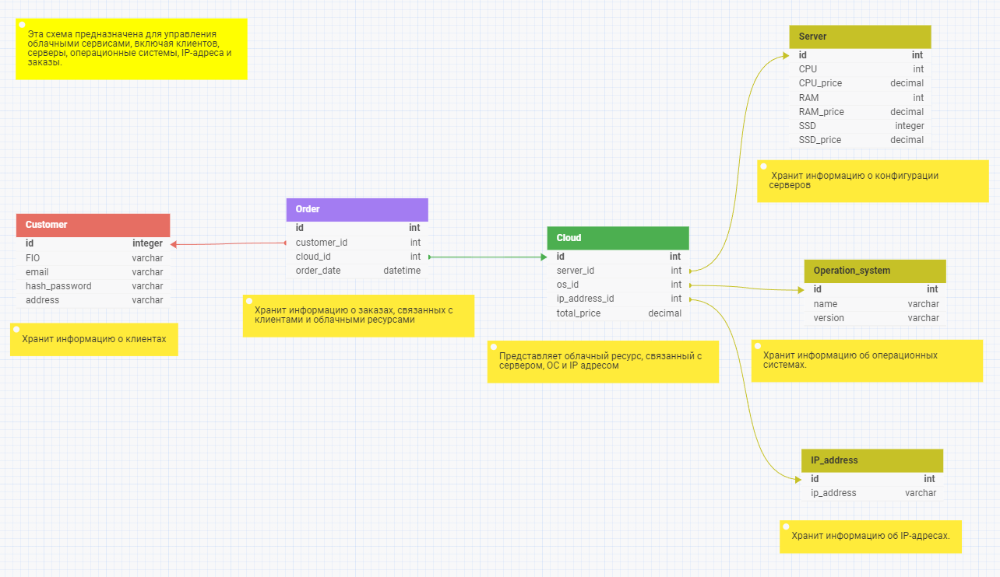

## Архитектура ПО

### Урок 9. Способы организации передачи данных между компонентами приложения, протоколы и API. REST, gRPC, очереди

**Задание 1**. Разработать экранные формы интерфейса для заказа ресурсов в облачном сервисе в https://www.figma.com/ или https://app.diagrams.net/.

**Задание 2**. Разработать полную ERD домена в https://www.dbdesigner.net/.

**Задание 3**. Дополнить swagger ответами домена (сутевые ответы) о статусе заказа ресурсов (создан, ошибка, нет ответа) и смоделировать ошибки REST «400, 500» типов.

**Задание 4**. Имплементировать сгенерированный swagger код в приложения студента.

### РЕШЕНИЕ:

1) UI - экранная форма пользовательского интерфейса

2) ERD-диаграмма домена 

3) UML - блок-схемf алгоритма взамодействия MVP

